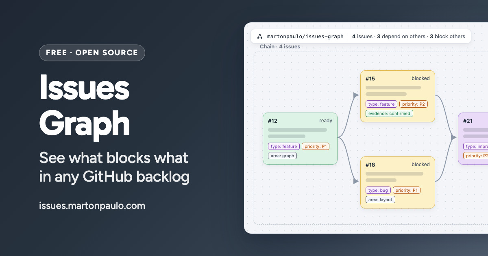

<div align="center">



# Issues Graph

See the blocking order of a GitHub backlog as a graph, in a browser, with nothing installed in the repository being read.

[](https://github.com/martonpaulo/issues-graph/actions/workflows/validate.yml) [](https://github.com/martonpaulo/issues-graph/actions/workflows/pages.yml) [](https://react.dev/) [](https://vite.dev/) [](https://www.typescriptlang.org/)

</div>

Issues Graph points at any public repository and renders that repository's **open issues**, the
native **`blocked by`** relationships between them, and the native **sub-issue hierarchy**, as a
graph you can read. Each card names its own state in words — `ready`, `unassigned`, `blocked`,
`in progress`, `needs attention`, `delivered` — read from the issue's own labels, assignees and
dependency counts.

It is a **static page**. There is no backend, no credential of its own, and **no generated graph
file in the repository being rendered** — every read goes straight to the public GitHub REST API
from the browser, and the relationships GitHub already tracks are the only source of truth for the
edges: `blocked by` for the solid arrows, the sub-issue hierarchy for the dashed ones.
<br />

---

<br />

## 🌱 Quick Start

```bash
npm ci
npm run dev
```

Then open `http://localhost:5173`. Vite's default port; nothing else is configured.

Prerequisites: **Node.js 22 or newer** (CI runs 22) and npm. No credential is needed to run or to
read a repository — a GitHub token is optional, and only raises the rate limit.

<br />

## 🛠 Commands

| Command | What it does |
| --- | --- |
| `npm run dev` | Development server |
| `npm run build` | Production build into `dist/` |
| `npm run preview` | Serves the built `dist/` the way the deployed site is served |
| `npm run typecheck` | TypeScript, no emit |
| `npm run lint` | ESLint over the whole repository |
| `npm test` | Vitest, against captured API fixtures |
| `npm run social-card` | Renders `design/social-card/social-card.html` into `public/social-card.jpg` (on a Mac) |

<br />

## 🔐 Secrets and variables

The project reads **none**. There is no environment variable, no `.env` file, no GitHub Actions
secret and no application credential anywhere in this repository; every product read is
unauthenticated, and the deployment is a GitHub Pages build that needs nothing beyond the workflow's
own token.

The optional GitHub token a visitor may paste belongs to that visitor, is kept in their browser and
is never committed here. See [Rate limit](#rate-limit).
<br />

---

<br />

## Reading it without the picture

The arrows are not the only way through the graph. Every card describes its own place in words —
`Issue #25. Blocked by #23 and #24. Blocks #31.` — and the list button in the top-right corner
opens the whole relationship set as a table, one row per drawn edge, with the blocker's state
beside it. Both are derived from the same edges the canvas draws, so they say what the picture
says. The direction an arrowhead carries is written out too: **arrow: blocker → dependent**.

<br />

## Keyboard shortcuts

On the canvas, with nothing focused in a field and no dialog open:

| Key | What it does |
| --- | --- |
| `Esc` | Clear the selection |
| `⌘A` or `Shift`+`A` | Select every issue |
| `F` | Fit the whole graph back on screen |
| `D` | Dim the selected issues |
| `R` | Restore the selected issues from dimmed |
| `Enter` | Open the selected issue on GitHub, when exactly one is selected |

A key pressed inside an input, a text area, or an open overlay belongs to that control, and
anything held with `Alt` or `Ctrl` is left to the browser.

<br />

## Rate limit

Unauthenticated GitHub requests share 60 per hour per IP address, and reading a repository costs
one request per 100 issues plus one per issue that has blockers. The page tells you what a read
will cost before it spends anything.

If that is not enough, open **GitHub token** on the start screen and paste your own
[fine-grained personal access token](https://github.com/settings/personal-access-tokens); read
access to public repositories is all it needs. The limit becomes 5000 per hour.

The token is yours, not this page's:

- it is kept in your browser's `localStorage`, on your device only;
- it is sent only to `api.github.com`, in the `Authorization` header, never in a URL;
- **Remove** deletes it, and the page goes back to reading unauthenticated.

Nothing is registered under this repository's owner, and no token is ever committed here. Anyone
who can run scripts in your browser on this origin can read what `localStorage` holds, so use a
token scoped to public reads and revoke it when you are done.

<br />

## Saved copies

Reading a repository saves its graph in your browser, so opening it again costs no GitHub
requests. The page always says how old a saved copy is and what it covers, and **Fetch now** reads
the repository live instead.

Six repositories are kept, most recently used first, and no more than about a megabyte between
them. Whichever falls off the end loses its saved graph and its dimmed cards together; nothing
else in the browser is touched, and nothing is lost that reading GitHub again cannot rebuild.

**Clear saved data**, on the screen that offers the saved copy, removes everything held for that
one repository straight away. Other repositories and your token are left alone; the token has its
own **Remove**.

<br />

## Sharing a graph

The link icon on the graph copies a URL that draws exactly what is on screen. Whoever opens it
spends none of their own GitHub budget: the graph itself travels in the URL, and the page makes no
request to `api.github.com` at all on that path.

```text
/dependencies/<owner>/<repo>#g=<the graph>
```

The graph rides in the fragment — the part after `#` — which browsers never send to a server. It
therefore reaches neither GitHub Pages nor its logs, and there is nowhere for it to be stored:
nothing is uploaded, no account is written to, and no short-link service is involved.

A shared graph is a point-in-time copy and says so on screen, with the same age and coverage the
page shows for your own saved copies. **Read latest from GitHub** leaves it behind and reads the
repository live.

<br />

## Tests and fixtures

Tests run against fixtures in `src/__fixtures__/`, captured from the live API rather than written by
hand — a hand-written payload asserts what somebody assumed the API returns. Recapture them with an
authenticated `gh` CLI:

```bash
node scripts/capture-fixtures.mjs <owner>/<repo> [<owner>/<repo>...]
```

Each repository stores a projected issue list, its `blocked_by` pages, and one complete unprojected
issue payload that proves the projection drops no field the client reads. A slug GitHub has renamed
is refused rather than followed silently, so a fixture is never written under a name that no longer
exists.

Card heights are computed without a browser, so `src/interMetrics.ts` holds the label-chip character
advances captured from the shipped Inter face by `scripts/capture-chip-metrics.mjs`. Regenerate it
after upgrading `@fontsource-variable/inter` or changing the chip font size; a stale table makes
cards a row too short and the chips hang out of them.

<br />

## Related repositories

Three repositories divide this work, and the boundary between them is deliberate:

| Repository | Owns |
| --- | --- |
| [`martonpaulo/skills`](https://github.com/martonpaulo/skills) | The agent skills that capture, plan, groom and implement issues — including the ones that **create and verify** the GitHub issue dependencies this viewer renders |
| [`martonpaulo/arbaro`](https://github.com/martonpaulo/arbaro) | The local-first board that drives those issues through planning, implementation, CI and review with AI agents |
| **`martonpaulo/issues-graph`** (this one) | The visualization. It reads; it never writes |

The data flows one way, and this repository is the last step:

```text
skills                                     creates and verifies dependencies
   ↓
GitHub native issue relationships          the source of truth
   ↓
issues-graph                               renders them
```

This viewer is not authoritative for anything. Deleting it would lose a view, never a fact.

<br />

## History and versioning

Extracted from [`martonpaulo/arbaro`](https://github.com/martonpaulo/arbaro), where it lived as
`web/`, so that repository stays what its name says it is. The commit history came with it.

There is no version number, deliberately. Nothing pins this repository, so there is no compatibility
contract a version could describe: `main` is what is deployed, and Git history is the record.
[`AGENTS.md`](AGENTS.md) carries the full policy and [`docs/product.md`](docs/product.md) says what
this is and what it will never do.
<br />

---

<br />

## Limitations

- Only **open** issues are drawn, and only the relationships GitHub itself tracks — a dependency
  written in prose is invisible here.
- Unauthenticated reads share 60 GitHub requests per hour per IP address; a large backlog can
  exhaust that in one read without a token.
- A shared link carries the graph in its fragment, so above roughly 32,000 characters — a few
  hundred issues — the page declines to build one instead of handing you a truncated link.
- Saved copies are per-browser and bounded to six repositories and about a megabyte.
- The viewer never writes: it cannot create, verify or repair a dependency.

<br />

## License

[MIT](LICENSE) © 2026 Marton Paulo.
